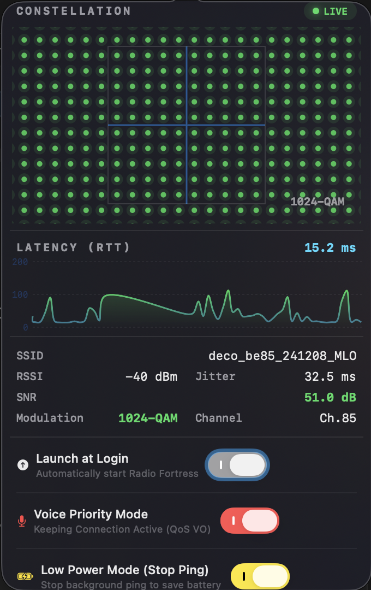

# Radio Fortress 📡

macOSメニューバーでWiFi通信品質を**擬似コンスタレーション・ダイアグラム**として可視化するユーティリティ。



## 概要

WiFiの変調方式（BPSK / QPSK / 16-QAM / ... / 1024-QAM）に応じた信号点をコンスタレーション・ダイアグラム（星座グラフ）として描画し、通信の「密度」と「品質」をリアルタイムに可視化します。

## 主な機能

### 1. 通信品質モニタリング (Constellation)
- **リアルタイム可視化**: RSSI / Noise / TxRate を監視し、変調方式を推定して点配置を決定。
- **静的グリッド表示**: 視認性を重視し、アニメーションを排した静的なグリッドと強調された中心軸で表示。
- **変調方式連動**: メニューバーアイコンは変調方式に応じてドット密度が変化（2x2 〜 5x5 Grid）。

### 2. レイテンシ監視 (Ping Monitor)
- **Pingグラフ**: Google Public DNS (8.8.8.8) へのPing応答速度（RTT）をリアルタイムグラフ化。
- **Jitter計測**: RTTの揺らぎを標準偏差として算出し、回線品質を評価。

### 3. Voice優先モード (Voice Keep-Alive)
- **低遅延化**: 定期的にVoiceカテゴリ(AC_VO)の軽量パケットを送信することで、無線チップの省電力モード遷移を防ぎ、パケット詰まりを軽減。
- **用途**: オンライン会議やボイスチャット時のラグ対策に実験的に使用可能。

### 4. ユーティリティ設定
- **Launch at Login**: ログイン時にアプリを自動起動設定が可能。
- **Low Power Mode**: バッテリー駆動時などにPing監視プロセスを停止し、消費電力を抑制するモードを搭載。

## 動作環境

- macOS 13.0 (Ventura) 以降
- WiFi接続環境

## インストールと実行

Xcodeがインストールされている必要があります。

1. プロジェクトを開く:
   ```bash
   open RadioFortress.xcodeproj
   ```
2. ビルド & 実行 (`Cmd + R`)

アプリはメニューバー常駐型です。Dockには表示されません。
- **左クリック**: ポップオーバー表示（詳細グラフ、設定）
- **右クリック**: メニュー表示（終了）

## ライセンス

MIT License
